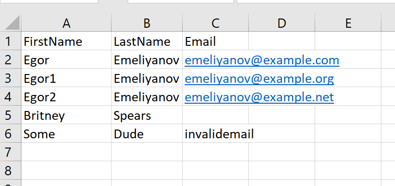
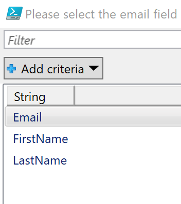
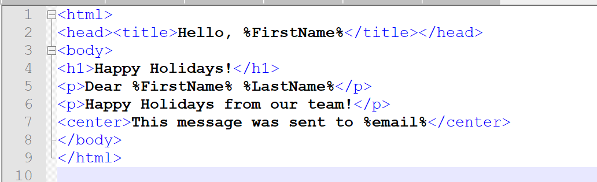

# Send-MassEmailViaO365

Since this has been a recurring task for me every Christmas season for the last 10 years (and each and every time I had to write this from scratch) I decided to dump it here for future reference.

This script sends bulk email via Office365. Since mail merge dumps everything in your Outbox and may incur Microsoft wrath on your account and/or throttling, this script operates with a graceful 10 second delay and additional exponential backoff if messages are not being accepted.

1. Run the script.
2. You will be prompted for the CSV file with recipient data. It should look just like any CSV file (unicode is ok):

3. You will be prompted to pick a field that contains emails.

4. You will be prompted to specify path to your HTML email body template. You can add %variables% enclosed in percent signs and those will we expanded into the actual field values from your CSV:

5. You will be prompted for email subject. %Fieldnames% are expanded here as well.
6. Emails will be generated and sent.
